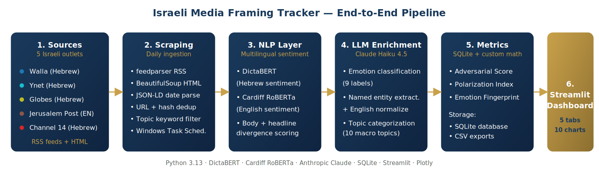
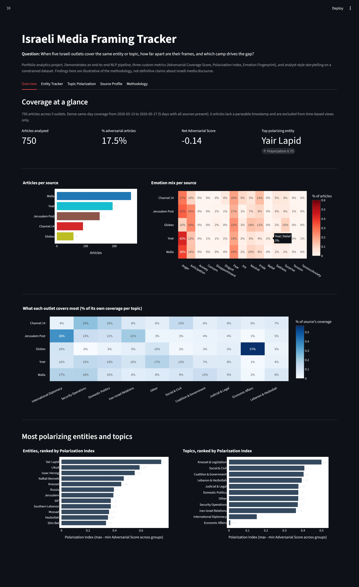
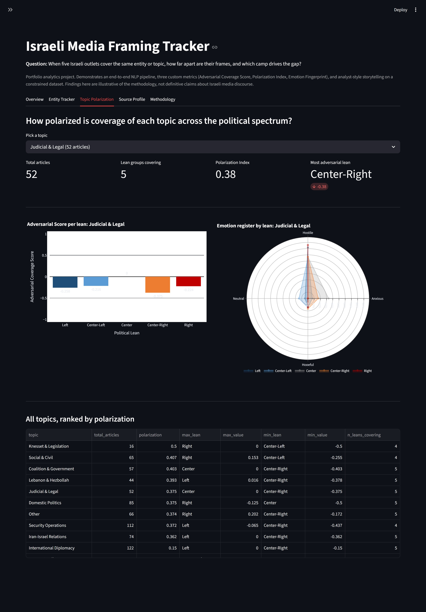
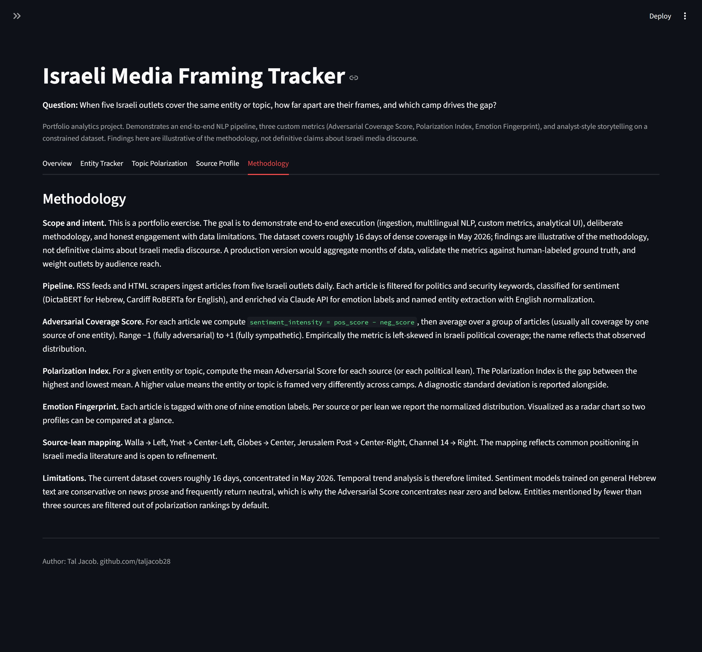

# Israeli Media Framing Tracker

> An end-to-end NLP analytics pipeline that quantifies how five Israeli news outlets frame the same political entities and topics, surfacing measurable polarization signals through three custom metrics and a five-tab Streamlit dashboard.




---

## The Business Question

Israeli media is polarized, but the diagnosis is usually anecdotal. This project replaces anecdote with measurement and answers one operational question:

> **When five Israeli outlets cover the same entity or topic, how far apart are their frames, and which camp drives the gap?**

That single question splits into four sub-questions an analyst at a PR firm, a corporate communications team, or a political consultancy would need to answer:

1. **Where is the line?** How wide is the cross-outlet frame gap on a given entity or topic.
2. **Who is the most polarizing public figure?** Ranked by measurable cross-outlet divergence.
3. **Does each outlet carry a stable emotional fingerprint** that persists across topics.
4. **Does political lean explain the variance**, or is a second axis at work.

The pipeline, the three custom metrics, and the five dashboard tabs all answer back to these four questions.

---

## What I Built

A live portfolio project. Daily ingestion runs via Windows Task Scheduler. Findings below reflect a snapshot of **750 articles** across **16 days**.

- **Multilingual NLP pipeline** moving politics and security articles from five Israeli outlets (Walla, Ynet, Globes, Jerusalem Post, Channel 14) into a deduplicated SQLite warehouse.
- **Three custom analytical metrics** designed from first principles:
  - **Adversarial Coverage Score**: mean sentiment intensity per group, range -1 to +1.
  - **Polarization Index**: max minus min Adversarial Score across groups.
  - **Emotion Fingerprint**: normalized distribution across four registers (Hostile, Anxious, Hopeful, Neutral).
- **Two-pass sentiment classification.** DictaBERT for Hebrew (648 articles), Cardiff RoBERTa for English (102 articles). Separate body and headline passes capture clickbait amplification.
- **Claude API enrichment** for nine-label emotion classification, named entity recognition with Hebrew-to-English normalization (1,002 unique entities), and 12-category topic labeling.
- **Five-tab Streamlit dashboard** with ten interactive Plotly visualizations: KPI cards, source-by-emotion heatmap, source-by-topic specialization heatmap, four-axis emotion radars, adversarial bar charts, polarization rankings, and a most-adversarial-headlines table per entity.
- **Production engineering.** JSON-LD date extraction fixed a bug that left 35% of Walla and Channel 14 articles timestampless; the backfill script then recovered 100% of those dates. Daily scheduling, deduplication, and structured logging round out the layer.

A one-page executive PDF lives at [docs/Project_Summary.pdf](docs/Project_Summary.pdf).

---

## The Dashboard

**Overview.** Coverage at a glance: four headline KPIs, articles-per-source, source-by-emotion mix, and what each outlet covers most. The bottom of the tab ranks every entity and topic by Polarization Index.



**Entity Tracker.** Pick any of 29 tracked entities. The tab shows the Adversarial Score per source, the emotion register radar, and the most hostile headlines mentioning that entity. Netanyahu shown below: Ynet is the most adversarial source at -0.246, Globes is neutral at 0.000, gap of 0.25.



**Topic Polarization.** Aggregate the five outlets into five political lean categories. For Judicial & Legal coverage, Center-Right is the most adversarial at -0.375, Center is neutral, polarization gap is 0.38.


**Source Profile.** Each outlet's emotional fingerprint against the market average, plus the entities it frames most adversarially. Ynet shown below: 194 articles, average Adversarial Score of -0.201, dominant emotion anger, harshest framing on Israeli Police, Israeli Government, and the Israeli Basketball League.



**Methodology.** Explicit metric definitions, source-to-lean mapping, and limitations, documented in-app so the user verifying the work has the full picture.


---

## Key Findings

> Numbers come from the current 750-article, 16-day snapshot. They illustrate what the methodology surfaces, not generalizable claims about Israeli media.

**Cross-outlet framing gaps are large and structured.** Mean Polarization Index across 13 tracked entities is 0.41, with a maximum of 0.75 (Yair Lapid) and a minimum of 0.05 (Lebanon). The gap correlates with source identity in stable ways, not random noise.

**Yair Lapid is the most polarizing entity, not Netanyahu.** Walla covers Lapid at -0.667 (hostile), Jerusalem Post at +0.085 (sympathetic). Netanyahu ranks only eighth in polarization at 0.27, because every outlet covers him adversarially. The disagreement is not over whether to be critical; it is over which figures deserve the criticism.

**Each outlet has a stable emotional fingerprint that cuts across topics.** Ynet leads on anger (42%), Walla on a mix of anger and fear (36% / 24%), Channel 14 on a distinctive Hopeful register (14% pride, 9% joy), Globes on anticipation and fear (24% / 22%), Jerusalem Post on anger and anticipation (32% / 24%). The signature persists when topic mix is controlled for.

**Political lean only partly explains framing.** The left-right axis predicts framing on Judicial & Legal (polarization 0.38) and Coalition & Government (0.40), but not on Security Operations or International Diplomacy. A second axis is at work: domestic versus international focus. Globes and Jerusalem Post cover international stories adversarially; Walla and Ynet cover domestic politics adversarially.

---

## Bottom Line for a Stakeholder

**For PR and corporate communications.** Globes is structurally different from the other four outlets on both emotional register and topic mix, which makes it the right entry point for any financial or commercial pitch. Ynet's adversarial baseline means it requires a different playbook.

**For political consulting.** The Polarization Index ranks public figures by how divided their coverage is, a leading indicator of reputational exposure. A figure with a high polarization score is reading two different narratives about themselves depending on the outlet. The Entity Tracker tab quantifies that gap and shows which outlets drive each side.

---

## Methodology

**Adversarial Coverage Score.** For each article, `sentiment_intensity = pos_score - neg_score`, then averaged over a group (usually all coverage by one source of one entity). Range -1 (fully adversarial) to +1 (fully sympathetic). Empirically left-skewed in Israeli political coverage; the metric name reflects that observed distribution.

**Polarization Index.** For an entity or topic, compute the mean Adversarial Score per source (or per lean category). The Polarization Index is the gap between the highest and lowest mean, with a standard-deviation diagnostic alongside. Sources with fewer than two articles on the entity are excluded to avoid inflating the index on thin coverage.

**Emotion Fingerprint.** Each article carries one of nine Claude-assigned emotion labels. Labels collapse into four registers for the radar charts: **Hostile** (anger, disgust, disappointment), **Anxious** (fear, sadness, anxiety, tension, concern), **Hopeful** (anticipation, joy, pride, relief), **Neutral** (neutral, surprise).

**Source-to-lean mapping.** Walla → Left, Ynet → Center-Left, Globes → Center, Jerusalem Post → Center-Right, Channel 14 → Right. Reflects common positioning in Israeli media literature; documented explicitly in-app so the user is free to override it.

---

## Tech Stack

| Layer | Tools |
|-------|-------|
| Language | Python 3.13 |
| Scraping | feedparser, requests, BeautifulSoup, lxml, JSON-LD extraction |
| Hebrew NLP | transformers, DictaBERT (`dicta-il/dictabert-sentiment`) |
| English NLP | Cardiff RoBERTa (`cardiffnlp/twitter-roberta-base-sentiment-latest`) |
| LLM | Anthropic Claude (Haiku 4.5) for emotion, entity, topic enrichment |
| Storage | SQLite via SQLAlchemy, CSV exports |
| Dashboard | Streamlit, Plotly (bar, scatter, radar, heatmap) |
| Analytics | pandas, numpy |
| Scheduling | Windows Task Scheduler |

---

## Project Structure

```
hebrew-news-sentiment/
├── app/streamlit_app.py         # 5-tab interactive dashboard
├── src/                         # All importable modules
│   ├── config.py                # Source registry, keywords, paths
│   ├── scrapers.py              # RSS scrapers
│   ├── archive_scrapers.py      # HTML archive scrapers with JSON-LD parsing
│   ├── nlp.py                   # DictaBERT + RoBERTa wrappers
│   ├── claude_analyzer.py       # Claude API enrichment wrapper
│   ├── database.py              # SQLAlchemy schema and session helpers
│   ├── data_load.py             # Quality-filtered dataframe loaders
│   ├── metrics.py               # Adversarial Score, Polarization Index, Fingerprint
│   └── viz.py                   # Plotly chart builders
├── scripts/                     # Runnable end-to-end scripts
│   ├── pipeline.py              # Orchestrator: scrape, classify, store
│   ├── analyze_existing.py      # Claude enrichment on unanalyzed rows
│   ├── data_clean.py            # Cleaning and feature engineering
│   ├── prepare_final_data.py    # Final CSV exports
│   ├── diagnose_dates.py        # Locate publish dates in raw HTML
│   ├── backfill_dates.py        # Recover missing timestamps
│   └── build_summary_pdf.py     # One-page executive PDF builder
├── data/exports/                # Clean article + entity CSVs (committed)
├── docs/                        # PDF summary, dashboard screenshots, pipeline diagram
├── run_pipeline.bat             # Windows Task Scheduler entry point
├── requirements.txt
└── LICENSE
```

---

## Setup

This repo ships with clean CSV exports (`data/exports/`), so the dashboard runs immediately without re-running the pipeline.

```bash
git clone https://github.com/taljacob28/hebrew-news-sentiment.git
cd hebrew-news-sentiment

python -m venv .venv
.\.venv\Scripts\Activate.ps1     # Windows PowerShell
# source .venv/bin/activate       # macOS / Linux

pip install -r requirements.txt
streamlit run app/streamlit_app.py
```

### Extending the dataset

Place an Anthropic API key in `.env`, then:

```bash
python scripts/pipeline.py --run                  # latest RSS articles
python scripts/pipeline.py --archive --days 14    # archive backfill
python scripts/analyze_existing.py --auto         # Claude enrichment on new rows
python scripts/data_clean.py                      # cleaning and features
python scripts/prepare_final_data.py              # final CSVs
```

The first run downloads the DictaBERT and Cardiff RoBERTa models (~1 GB combined, one-time).

---

## Limitations

- **Thin time window.** Current snapshot covers about 16 days. Daily collection is ongoing.
- **Conservative Hebrew sentiment models.** DictaBERT scores most news prose as neutral, which is why the Adversarial Score concentrates near zero. A production version would calibrate on labeled news data.
- **Source-to-lean mapping is editorial.** Reflects common positioning in Israeli media research; open to refinement.
- **RSS bias.** Outlets that publish primarily through mobile apps are underrepresented.
- **Entity normalization carries model error.** Claude maps Hebrew entity mentions to canonical English forms; validated on a small held-out sample.

---

## Roadmap

- Calibrate sentiment thresholds with a small human-labeled validation set.
- Add an explicit framing-divergence page comparing headline vs body intensity per outlet over time.
- Bring online a sixth source to break ties in cross-source comparisons.
- Build a weekly email digest that flags the day's most polarized entity.

---

## Contact

**Tal Jacob.** PhD candidate, Political Science, Tel Aviv University. Transitioning to data analytics.

- GitHub: [@taljacob28](https://github.com/taljacob28)
- Email: [taljacob28@gmail.com](mailto:taljacob28@gmail.com)
- LinkedIn: [linkedin.com/in/tal-jacob-9753bb256](https://www.linkedin.com/in/tal-jacob-9753bb256)

## License

MIT
